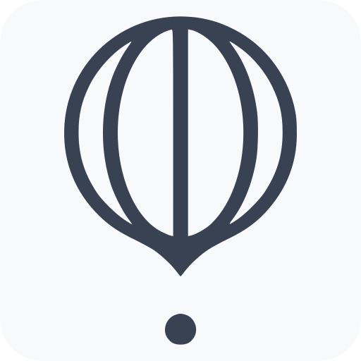

# Vizualla
>  Blogger Visual Platform 

## Development

To start developing components in this project, you will use NestJS as the core framework. For that, you need to follow the steps below:

1. Install the dependencies `pnpm install`.
2. Launch Storybook process `pnpm dev`.

<!--- Eraser file: https://app.eraser.io/workspace/Lpi8rwb5TDUBBSf9c74t --->
